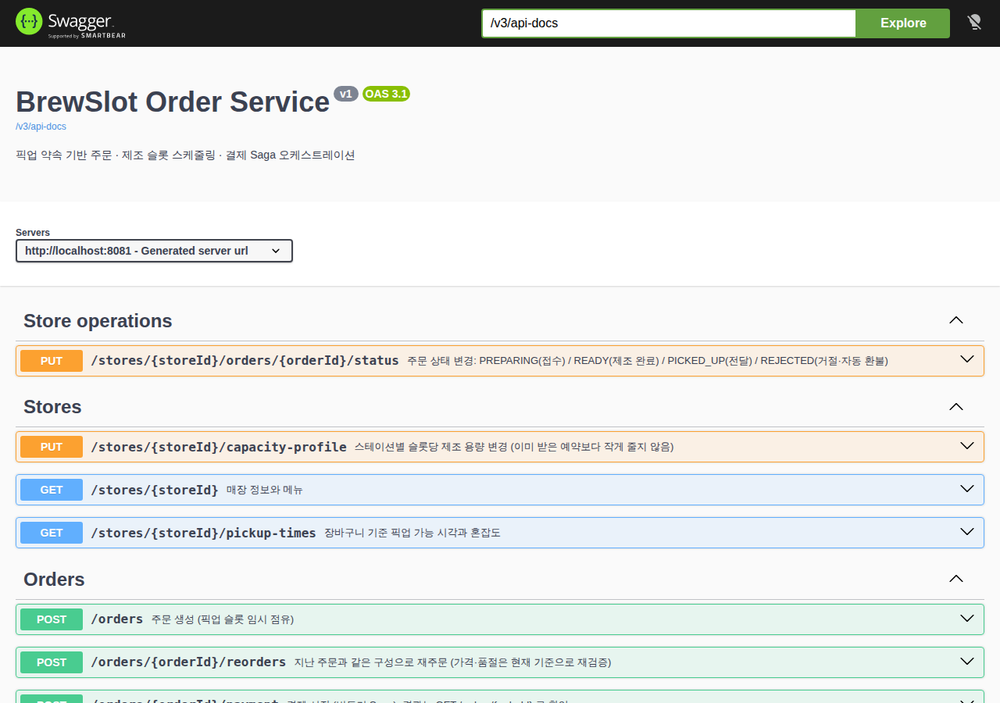
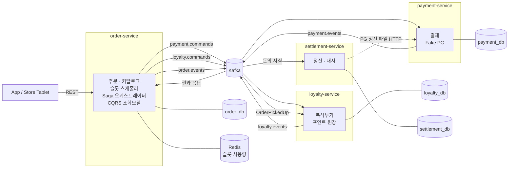
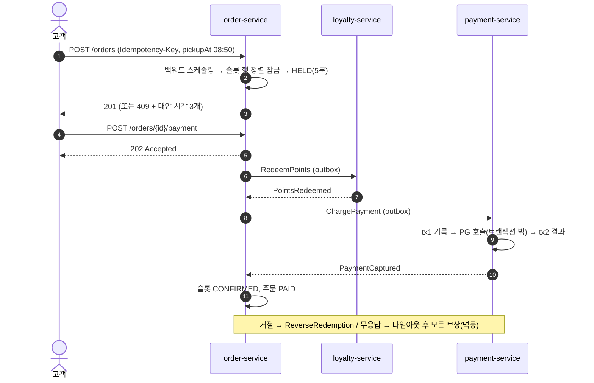

# ☕ BrewSlot — 약속한 픽업 시간을 지키는 카페 주문 플랫폼

[](https://github.com/sokldjs554/brewslot/actions/workflows/ci.yml)
    

> "8시 50분에 받을게요" — 고객이 **고른 시각**에 음료가 **정확히** 준비되도록,
> 매장의 실제 제조 능력(스테이션별 부하 × 음료 신선도)으로 주문을 받고, 결제·포인트·정산까지 돈이 한 원도 틀어지지 않게 흘려보내는 MSA 백엔드.

### ▶ 바로 실행해 보기 — 설치 없이 브라우저에서

[](https://codespaces.new/sokldjs554/brewslot?quickstart=1)

버튼을 누르면 클라우드 개발환경에서 **서비스 4개 + PostgreSQL · Kafka · Redis 가 자동으로 기동**되고 Swagger UI 가 열립니다 (첫 실행 3~5분).
터미널에서 `./scripts/demo.sh` 를 실행하면 12개 장면(주문 · Saga · 인기 시각 쏠림 · 보상 · PG 응답 유실 복구 · 정산 · 대사)이 설명과 함께 재현됩니다.
→ [5분 체험 가이드](docs/try-it.md) · [데모 실행 결과](docs/demo.md)



<br>

## 한눈에 보기

| | |
|---|---|
| **핵심 문제** | 출근 러시에 인기 시각으로 주문이 몰리면 "원하는 시간 픽업" 약속이 깨진다 |
| **핵심 해법** | 주문 건수가 아닌 **스테이션별 제조 부하 + 신선도 창** 기반 백워드 스케줄링, 불가 시 **대안 시각 제안** |
| **동시성** | 100명 동시 주문 → 정확히 이론값(3건)만 수락, **초과 예약 0** · 거절 97건 전부 대안 시각 포함 |
| **분산 트랜잭션** | Orchestration Saga (포인트 → 카드), Transactional Outbox, Idempotent Inbox, PG 결과 불명 복구 |
| **돈** | 복식부기 포인트 원장(DB 트리거로 차/대 균형 강제), 영업일 이월 정산, PG 파일 건별 대사 |
| **성능** | 부하 300 req/s에서 주문 p95 **34ms**, Saga p95 **13.7s → 0.46s** (Kafka 소비 병목 발견·수정) |
| **쿼리 튜닝** | 5개 핫 쿼리 before/after 실측 — Outbox 폴링 **140.9ms → 0.08ms**, 정산 마감 **161ms → 4.3ms** |
| **품질** | 테스트 **79개** (단위·Testcontainers 통합·**실행계획 회귀**·**API 드리프트**·**4서비스 E2E**·Python) |
| **AI-Driven** | Claude Code 로 PRD→설계→구현→검증→문서 전 과정 수행. 커맨드·서브에이전트·훅·PR 리뷰 자동화 포함 |

<br>

## 왜 이 주제인가 — 흔한 프로젝트와의 차이

카페 주문 / 주문·결제 MSA 오픈소스를 조사해 보면 대부분 다음 중 하나다.

| 흔한 접근 | 이 프로젝트 |
|---|---|
| 재고 차감·선착순 쿠폰으로 동시성 보여주기 | 커피는 재고가 아니라 **바리스타의 시간**이 병목이다 → 시간 슬롯 × 스테이션 부하 원장 |
| 시간대별 **주문 건수** 제한 (5분당 5건) | 아메리카노 1잔과 스무디 5잔은 다르다 → **메뉴별 부하(load unit)**, **스테이션별 용량** |
| 픽업 시간 = 대기열 순서로 계산된 "예상 시간" | 고객이 시각을 **고르고**, 시스템은 **지킬 수 있을 때만** 받는다. 못 지키면 가장 가까운 대안 3개 |
| 결제 성공/실패 두 가지 경로만 | PG **타임아웃(결과 불명)** → 복구 조회 → 늦은 승인 자동 취소까지 |
| 포인트 = `balance` 컬럼 ± | **복식부기 원장** + 만료 lot(FIFO) + 사용 취소 시 원래 lot 복원 |
| 정산은 범위 밖 | 영업일(KST) 마감, **마감 후 도착 이벤트 이월**, 건별 수수료 반올림, **PG 대사** |
| "인덱스 걸어서 빨라졌다" | 실행계획을 **테스트로 단언**, 재현 가능한 before/after 실측 |

<br>

## 아키텍처



- **database-per-service**, 서비스 간 통신은 Kafka(이벤트/명령) + HTTP(PG 파일)뿐. 모든 발행은 Outbox, 모든 소비는 멱등.
- 메시지 key = orderId → 같은 주문의 명령·이벤트는 파티션 내 순서 보장 ("차감 → 차감취소" 역전 불가).

### 주문 → 결제 흐름



<br>

## 핵심 설계

### 1. 픽업 약속 스케줄러 — [ADR-0001](docs/adr/0001-promise-based-slot-scheduling.md)
- 메뉴는 `station`(ESPRESSO/BLENDER/BREW_BAR) · `loadUnits` · `freshnessMinutes` 를 갖는다. 매장은 스테이션별 **5분 슬롯당 처리 부하**를 설정.
- 픽업 시각 T 의 음료는 `[T − 신선도, T)` 슬롯에서만 만들 수 있다 (식은 커피·녹은 얼음 방지).
- 제약이 빡빡한 음료부터 **가장 늦은 빈 슬롯**에 배정(JIT). 한 주문의 음료가 여러 슬롯에 나뉠 수 있다.
- 순수 함수 → 12개 단위 테스트로 규칙 고정. 불가 시 `409` + `alternatives`.
- 바리스타는 픽업 순이 아니라 **제조 슬롯 순** 큐를 본다 (`GET /stores/{id}/production-queue`).

### 2. 초과 예약 0 — [ADR-0002](docs/adr/0002-slot-capacity-concurrency.md)
- 원천은 PostgreSQL `slot_capacity`. 행 생성은 별도 짧은 트랜잭션, 점유는 **`ORDER BY station, slot_start FOR UPDATE`** → 교착상태 불가.
- 계획 이후 경합에 밀리면 **새 트랜잭션에서 재계획**. 최후 방어선 `CHECK (reserved <= capacity)`.
- Redis Lua 대안은 이중 기록·복구 기준 모호로 기각.

### 3. 조회와 잠금의 분리 — [ADR-0004](docs/adr/0004-caching-strategy.md)
- "몇 시에 받을 수 있지?" 조회는 Redis 슬롯 사용량 스냅샷만 읽는다. 커밋 후 갱신 + **버전 비교 Lua CAS** 로 순서 역전 방지.
- 캐시가 틀려도 결과는 "주문 시 409 + 대안" — 정합성은 항상 DB 가 판단한다. Redis 장애 시 DB 폴백.

### 4. 결제 Saga — [ADR-0005](docs/adr/0005-checkout-saga-orchestration.md) · Outbox — [ADR-0003](docs/adr/0003-transactional-outbox.md)
- **포인트 → 카드** 순서: 실패 확률 높고 보상 싼 단계를 앞에.
- PG 호출을 **DB 트랜잭션 밖**에서. 응답 유실 시 `UNKNOWN` → 복구 잡이 PG 조회로 확정, 먼저 와 있던 환불 명령은 예약 후 자동 실행.
- 보상 명령은 멱등("했으면 되돌리고, 안 했으면 무시") → 결과를 몰라도 안전하게 전부 보낸다.
- Outbox 릴레이는 advisory lock 으로 단일화 — 처리량보다 **같은 주문 이벤트의 순서**를 택함.

### 5. 복식부기 포인트 — [ADR-0006](docs/adr/0006-double-entry-point-ledger.md)
- 적립: 차) 브랜드 비용 / 대) 회원 지갑 · 사용: 차) 회원 지갑 / 대) 매장 정산 채권 · 소멸: 대) 브랜드 소멸수익
- **DEFERRABLE 제약 트리거**가 커밋 시점에 차/대 균형을 검사 — 잘못된 분개는 커밋 불가.
- 만료 임박 lot 부터 차감, 사용 취소 시 **정확히 같은 lot** 으로 복원. 불변식: 지갑 = Σlot = 원장.

### 6. 정산 · 대사 — [ADR-0007](docs/adr/0007-settlement-and-reconciliation.md)
- "돈이 움직인 사실" 이벤트만 적재(이벤트 ID 유니크 = 멱등). 영업일은 KST (23:59 결제 / 00:01 환불은 다른 날).
- 마감 후 도착한 과거 거래는 **다음 정산서에 이월** — 확정된 정산서는 불변.
- PG 수수료는 **건별 반올림 후 합산** (합계에 곱하면 PG 파일과 1원 어긋남 — 테스트로 고정).
- PG 파일 ↔ 원장 대사: `MISSING_IN_LEDGER` / `MISSING_IN_PG` / `AMOUNT_MISMATCH` / `FEE_MISMATCH`.

### 7. CQRS 조회 모델 · 원탭 재주문
- `order.events` 를 Kafka 로 투영해 회원 주문내역(keyset 페이지네이션), 매장 대시보드(**픽업 약속 준수율**, 평균 지연)를 만든다.
- 재주문 추천은 지난 장바구니를 **현재 가격·품절·지금 가능한 가장 빠른 픽업 시각**으로 재검증해 보여준다.

<br>

## 실패 시나리오 (전부 테스트로 고정)

| 시나리오 | 결과 | 검증 |
|---|---|---|
| 같은 시각에 40/100명 동시 주문 | 이론값만 수락, 초과 예약 0, 거절 전원 대안 시각 | 통합 테스트, k6 |
| 같은 Idempotency-Key 재요청 / 다른 내용 | 같은 주문 200 / 422 | 통합 테스트 |
| 결제 안 하고 이탈 | 5분 후 점유 해제, 용량 반환 | 통합 테스트 |
| 포인트 부족 | 카드 결제 시도 없이 취소 | Saga IT |
| 카드 거절 | 차감한 포인트 자동 복원 | Saga IT, **E2E** |
| PG 응답 유실 → Saga 타임아웃 → 늦은 승인 | 주문 취소, 늦은 승인 자동 취소, 포인트 복원 | Payment IT, **E2E** |
| 같은 이벤트 중복 전달 | 1회만 반영 | Saga IT, Loyalty IT, Settlement IT |
| 결제 후 매장 거절 | 환불 + 포인트 복원 + 슬롯 반환 | Saga IT |
| 같은 지갑 동시 사용 20건 | 잔액 초과 사용 0 | Loyalty IT |
| 마감 후 과거 거래 도착 | 다음 정산서에 이월 | Settlement IT |
| 차/대 불균형 분개 | DB 가 커밋 거부 | Loyalty IT |

<br>

## 성능

### 쿼리 튜닝 — [상세](docs/performance/query-plans.md) · 재현: `scripts/query-lab/run.sh`

| 쿼리 | 규모 | Before | After | 기법 |
|---|---|---:|---:|---|
| 주문내역 1000페이지째 | 200만 행 | 51.5 ms | 0.07 ms | keyset + 복합 인덱스 Index Only Scan |
| 결제 대기 만료 스캔 | 주문 200만 | 2.1 ms · 13 MB | 0.22 ms · **40 kB** | 부분 인덱스 |
| Outbox 폴링 | 200만 발행 완료 | 140.9 ms | **0.08 ms** | 부분 인덱스 |
| 포인트 사용 가능 lot | lot 300만 | 1.79 ms · 71 MB | 0.085 ms · 12 MB | 부분 인덱스 + 만료순 키 |
| 정산 마감 대상 | 원천 300만 | 161.2 ms | 4.3 ms | 부분 인덱스 Index Only Scan |

핵심 쿼리의 실행계획은 [`QueryPlanRegressionTest`](services/order-service/src/test/kotlin/com/brewslot/order/performance/QueryPlanRegressionTest.kt) 가 CI 에서 단언하고,
[`plan-doctor`](tools/plan-doctor) 가 규칙 기반으로 진단(`--fail-on high`)·Claude 리뷰(`--ai`)한다.

### 부하 테스트 — [상세](docs/performance/load-test.md)

4 vCPU 한 대에 k6 + 서비스 4개 + PostgreSQL + Kafka + Redis 를 모두 올린 환경, 60초, 오류 0%.

| API (300 req/s 혼합 부하) | p50 | p95 | p99 |
|---|---:|---:|---:|
| 픽업 가능 시각 조회 | 1.8 ms | 11.8 ms | 33.6 ms |
| 주문 생성 | 9.8 ms | 34.5 ms | 94.5 ms |
| 결제 시작 | 4.2 ms | 18.6 ms | 47.9 ms |
| **결제 시작 → 주문 확정 (Saga)** | 237 ms | **463 ms** | 688 ms |

> 첫 측정의 Saga p95 는 **13.7초**였다. 두 DB 의 타임스탬프를 주문 ID 로 조인해 구간을 쪼갠 결과 "결제 명령 소비 대기" 가 원인 —
> 리스너 동시성 1 이 파티션 3개를 레코드마다 동기 커밋하며 처리하고 있었다. 동시성을 파티션 수로 맞춰(순서 보장 유지) **처리량 2배에서 p95 0.46초**.

<br>

## 테스트 전략

| 층 | 무엇을 | 개수 |
|---|---|---:|
| 도메인 단위 | 스케줄러 규칙, 주문 상태기계, Saga 단계, lot 배분, 정산 계산, 대사, Money · UUIDv7 | 31 |
| 통합 (Testcontainers: PostgreSQL · Kafka · Redis) | 동시 주문, 멱등성, Saga 보상, PG 타임아웃 복구, 원장 불변식, 이월 정산 | 25 |
| 실행계획 회귀 | 운영 규모 데이터에서 인덱스·Sort·Seq Scan 단언 | 4 |
| API 드리프트 | 설계 명세(`docs/api`) ↔ 구현(springdoc) 경로·메서드·필수 헤더 | 2 |
| 아키텍처 | 도메인 계층의 프레임워크 무의존 (ArchUnit) | 3 |
| **E2E** | 4개 서비스를 한 JVM 에서 실제 Kafka 로 연결: 복합결제→픽업→적립→정산→대사, 거절, 타임아웃, 재주문 | 5 |
| plan-doctor (Python) | 진단 규칙, CI 게이트, Claude 요청 형태 | 9 |

```bash
./gradlew build     # Docker 필요. ktlint + 70개 JVM 테스트
```

<br>

## AI-Driven Development

이 프로젝트는 **Claude Code 로 설계부터 구현·검증·성능 분석·문서화까지** 진행했다. 핵심은 "AI 가 만든 결과물을 사람이 읽고 믿는 것" 이 아니라
**기계가 실패시키는 검증 장치를 먼저 깔고** 그 위에서 반복 개선하는 것이다. → [docs/ai-workflow.md](docs/ai-workflow.md)

| 장치 | 내용 |
|---|---|
| [`CLAUDE.md`](CLAUDE.md) | 구조·명령·**반드시 지킬 규칙 10개**(Outbox 전용 발행, 잠금 순서, 마이그레이션 불변, 돈은 `Money` ...) |
| [`.claude/commands`](.claude/commands) | `/prd-to-design`(PRD → 이벤트 스토밍·불변식·실패 시나리오·OpenAPI·태스크), `/review`, `/explain-plan`, `/new-event`, `/adr` |
| [`.claude/agents`](.claude/agents) | `saga-failure-analyst`(7가지 장애 유형 표 + 재현 테스트), `ddd-reviewer`, `query-plan-analyst` |
| [`.claude/hooks`](.claude/hooks) | 커밋된 Flyway 마이그레이션 **수정 차단**, 편집 모듈 자동 포맷 |
| [`claude-review.yml`](.github/workflows/claude-review.yml) | PR 마다 규칙 기반 자동 리뷰 (`ANTHROPIC_API_KEY` 등록 시) |
| [`tools/plan-doctor`](tools/plan-doctor) | 실행계획 규칙 진단 + Claude 리뷰(스키마 포함 · 프롬프트 캐싱 · 거절 시 폴백) |

AI 결과물을 분석하고 고친 실제 사례(E2E 가 잡은 설정 가정 오류, 실행계획 가정 반박, 진단 도구 오탐 수정, 부하 테스트로 찾은 소비자 병목)는
[ai-workflow.md §3](docs/ai-workflow.md#3-반복-개선-사례--ai-결과물을-분석하고-고친-기록) 에 있다.

<br>

## 실행

```bash
# 1) 인프라
docker compose up -d postgres kafka redis

# 2) 서비스 (각각 8081 order / 8082 payment / 8083 loyalty / 8084 settlement)
./gradlew bootJar
for s in order payment loyalty settlement; do
  KAFKA_BOOTSTRAP=localhost:29092 java -jar services/$s-service/build/libs/$s-service-0.1.0.jar &
done
# 또는 전부 컨테이너로: docker compose up --build

# 3) Swagger UI: http://localhost:8081/swagger-ui.html · 설계 명세: docs/api/order-service.yaml
```

**▶ 데모:** 서비스를 띄운 뒤 `./scripts/demo.sh` — 12개 장면(주문·Saga·쏠림·보상·PG 유실 복구·정산·대사)을 설명과 함께 실행한다.
실제 실행 결과: [docs/demo.md](docs/demo.md)

<details>
<summary><b>curl 로 전체 흐름 따라가기</b></summary>

```bash
PICK=$(python3 -c "import time;t=int(time.time())+1800;print(time.strftime('%Y-%m-%dT%H:%M:00Z',time.gmtime(t-t%300)))")

# 포인트 지급 (브랜드 1)
curl -XPOST localhost:8083/admin/point-grants -H 'Content-Type: application/json' -d '{"memberId":1,"brandId":1,"amount":3000}'

# 장바구니 기준 가능 시각과 혼잡도
curl "localhost:8081/stores/101/pickup-times?items=1004:2&items=1005:1"

# 주문 (아이스 바닐라라떼 2 + 딸기 스무디 1, 포인트 2,000 사용)
curl -XPOST localhost:8081/orders -H 'Content-Type: application/json' -H 'X-Member-Id: 1' -H 'Idempotency-Key: demo-00000001' \
  -d "{\"storeId\":101,\"pickupAt\":\"$PICK\",\"items\":[{\"menuItemId\":1004,\"quantity\":2},{\"menuItemId\":1005,\"quantity\":1}],\"pointsToUse\":2000}"

# 결제 (tok_declined: 거절, tok_timeout: PG 응답 유실 시나리오)
curl -XPOST localhost:8081/orders/{orderId}/payment -H 'Content-Type: application/json' -H 'X-Member-Id: 1' -d '{"cardToken":"tok_visa"}'

# 매장: 바리스타 제조 큐 → 상태 변경
curl localhost:8081/stores/101/production-queue
curl -XPUT localhost:8081/stores/101/orders/{orderId}/status -H 'Content-Type: application/json' -d '{"status":"PREPARING"}'   # READY → PICKED_UP

# 정산 마감 · PG 대사
curl -XPOST localhost:8084/settlement-runs -H 'Content-Type: application/json' -d "{\"businessDate\":\"$(TZ=Asia/Seoul date +%F)\"}"
curl -XPOST localhost:8084/reconciliation-runs -H 'Content-Type: application/json' -d "{\"businessDate\":\"$(TZ=Asia/Seoul date +%F)\"}"
```
</details>

<br>

## 기술 스택

| 영역 | 사용 |
|---|---|
| Language / Framework | Kotlin 2.2, Java 21, Spring Boot 3.5 (Web, JDBC, Kafka, Data Redis, Cache, Actuator), Python 3.12 (도구) |
| Data | PostgreSQL 16 (Flyway, 부분 인덱스, advisory lock, 제약 트리거), Redis 7 (Lua), Caffeine |
| Messaging | Apache Kafka 3.9 (KRaft) — Outbox / Inbox / DLT |
| API | REST, OpenAPI 3 (설계 우선 + 드리프트 테스트), RFC 9457 Problem Details, Idempotency-Key |
| Observability | Micrometer (Prometheus / Datadog registry), OpenTelemetry tracing — Kafka 경계 `traceparent` 전파 |
| Test | JUnit 5, AssertJ, Testcontainers, Awaitility, ArchUnit, k6, pytest |
| DevEx | Gradle 멀티모듈, ktlint, GitHub Actions, Docker Compose, **Claude Code** |

### 관측 지표 (Datadog 전송 가능: `DATADOG_ENABLED=true DD_API_KEY=...`)
`brewslot.pickup.promise.lateness`(약속 대비 지연 분포) · `brewslot.slot.rejections`(스테이션별 용량 거절) · `brewslot.slot.cache`(hit/rebuild/fallback)
· `brewslot.slot.reservation.race_retries` · `brewslot.outbox.lag` · `brewslot.payment.result`

<br>

## 프로젝트 구조

```
brewslot
├── libs
│   ├── common          Money(원), BusinessTime(KST 영업일), UUIDv7
│   ├── web             RFC 9457 오류 응답
│   ├── messaging       이벤트 계약 · Outbox · Inbox · DLT
│   └── test-support    Testcontainers · MutableClock · QueryPlan 단언
├── services
│   ├── order-service       catalog / scheduling / ordering(+saga) / query(CQRS)
│   ├── payment-service     결제 + Fake PG(승인·거절·타임아웃·정산 파일)
│   ├── loyalty-service     복식부기 포인트 원장
│   └── settlement-service  정산 마감 · PG 대사
├── e2e                 4개 서비스 한 JVM E2E
├── tools/plan-doctor   실행계획 진단 (Python, Claude API)
├── scripts/query-lab   쿼리 튜닝 재현 실험
├── load-test           k6 시나리오
├── docs                prd · adr · api · performance · ai-workflow
└── .claude             commands · agents · hooks
```

<br>

## 한계와 다음 단계

- **Outbox 폴링 지연(~200ms)**: 커밋 직후 릴레이를 깨우는 방식으로 Saga p50 을 더 줄일 수 있다.
- **인기 슬롯 잠금 직렬화**: 슬롯당 초당 수백 건 이상이 필요해지면 슬롯을 서브 버킷으로 나눠 잠금을 분산.
- **이벤트 계약**: 지금은 공유 Kotlin 모듈 + 호환 규칙. 서비스가 독립 배포되면 Schema Registry 로 이전.
- **인증/인가**: 게이트웨이가 `X-Member-Id` 를 주입한다고 가정. 매장 API 의 점주 권한 검증은 범위 밖.
- **스케줄러 최적성**: 탐욕법(tight-first, latest-fit). 대형 단체 주문이 많아지면 배정 품질을 측정해 재검토.
